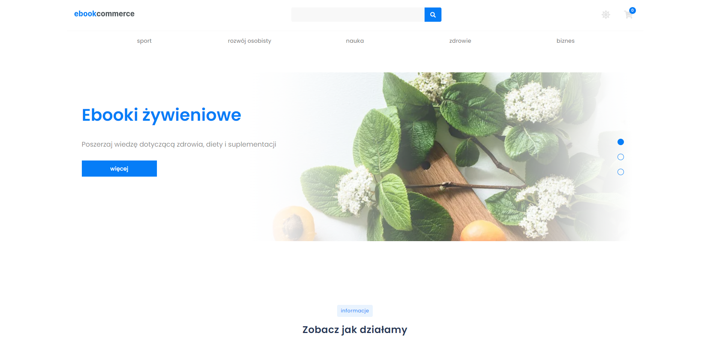
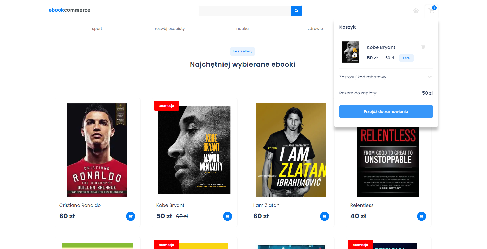
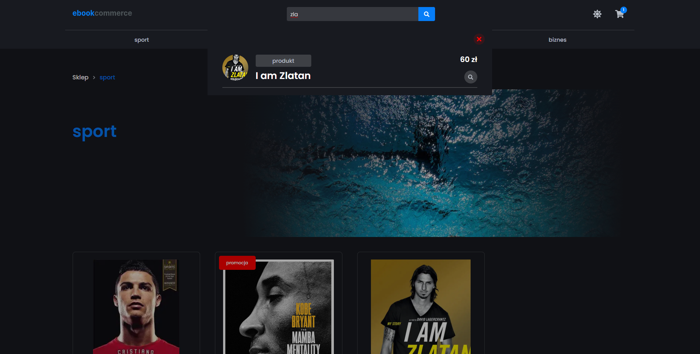
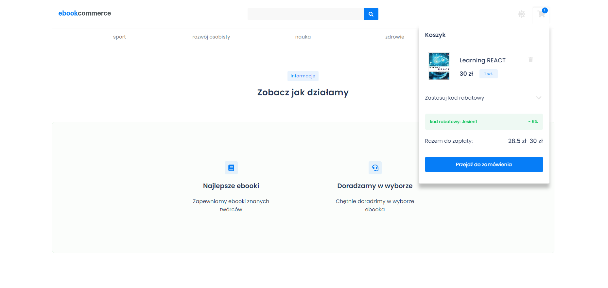
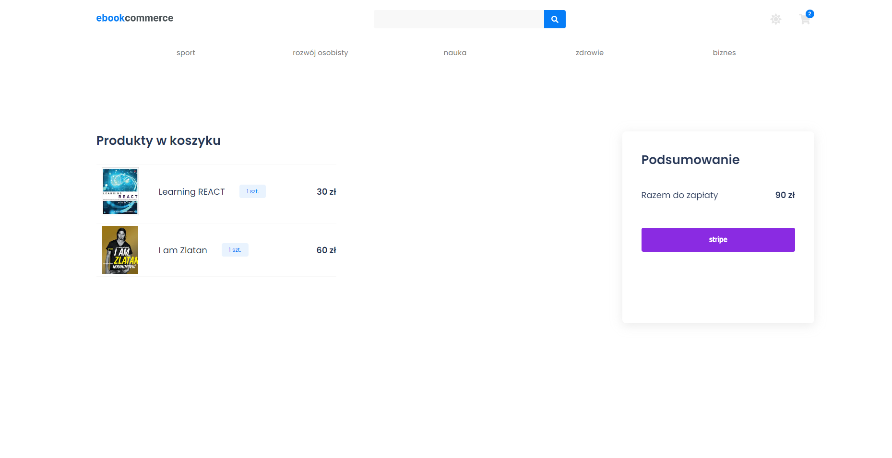

<h1 align="center">Ebookcommerce</h1>











## Project Overview

The ebookcommerce project introduces an e-book store. The store offers e-books from various categories such as sports, health and science. In order to find the e-book faster, there is a product and category search engine in the navigation. Products can be added to the cart, use the discount code and complete the transaction via stripe. The next.js framework with the libraries listed below was used in the construction of the frontend. Product or category data is retrieved from headless cms contentful

## Tech used

| Tech                                                | Description                                                                           |
| --------------------------------------------------- | ------------------------------------------------------------------------------------- |
| [Next.js](https://nextjs.org/)                      | The React Framework for production                                                    |
| [Typescript](https://www.typescriptlang.org/)       | Javascript superset language                                                          |
| [Styled Components](https://styled-components.com)  | CSS-in-JS styling framework                                                           |
| [Redux Toolkit](https://redux-toolkit.js.org/)      | The official, opinionated, batteries-included toolset for efficient Redux development |
| [React Hook Form](https://www.react-hook-form.com/) | Open source form library for React                                                    |
| [Framer Motion](https://www.framer.com/motion/)     | Motion library for React                                                              |

## Live

https://ebook-ecommerce-difr.vercel.app/

## Installation

```bash
git clone https://github.com/LucaMederak/ebook-ecommerce.git
npm install
# set up environment variables
npm run dev
```
